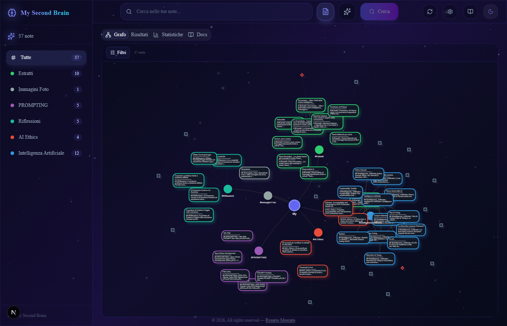
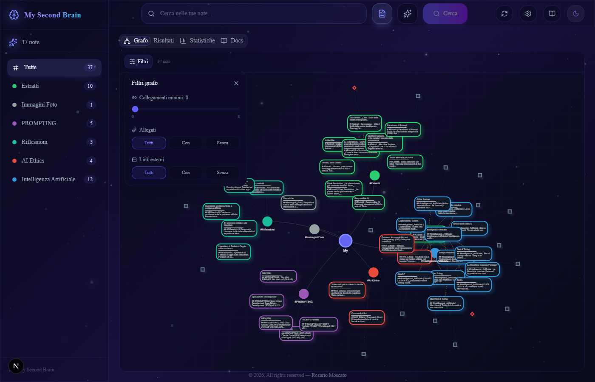
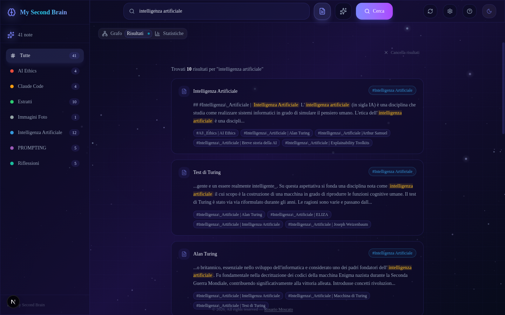
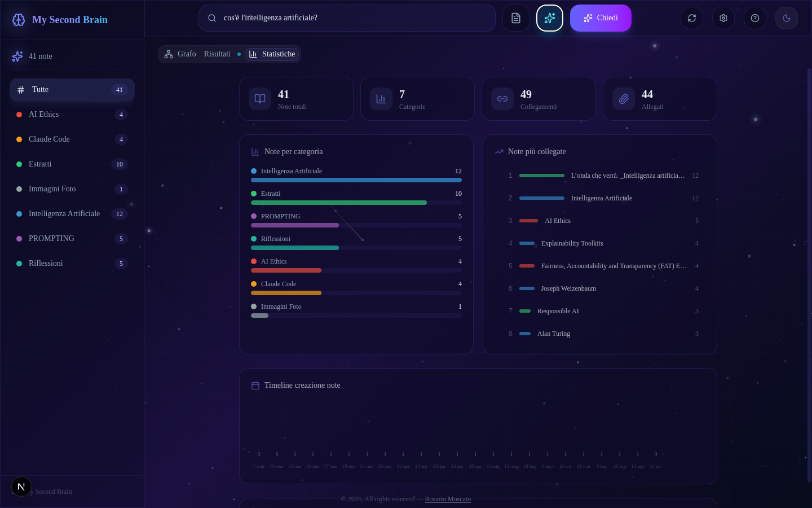
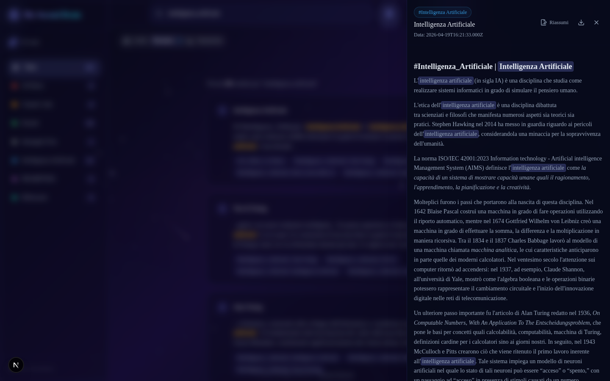
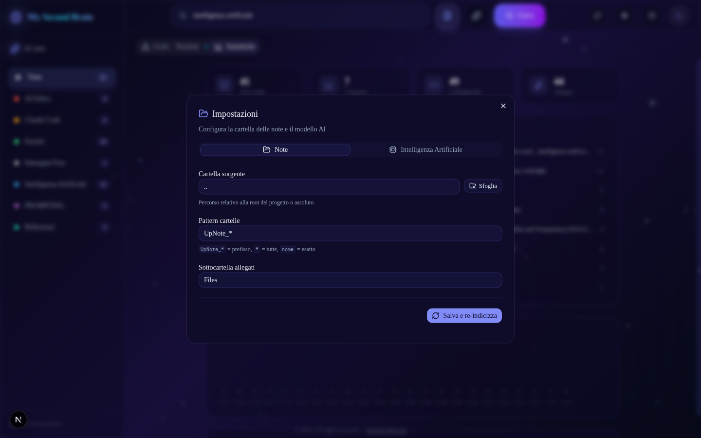
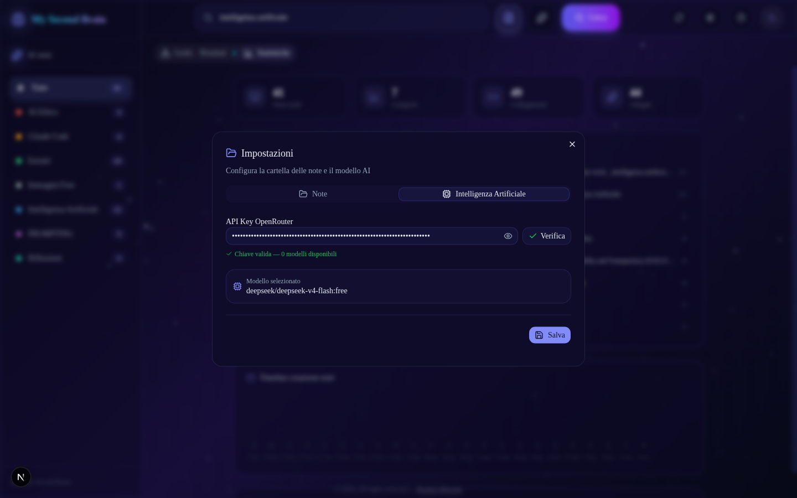
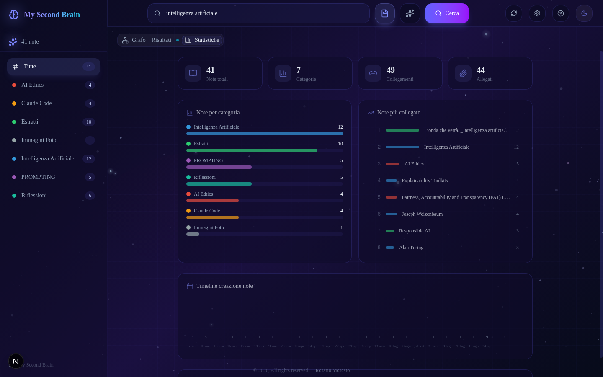

# My Second Brain — Guida Utente

Esplora, cerca e interroga le tue note markdown con l'aiuto dell'intelligenza artificiale. Grafo interattivo con **drag & drop**, nodi per link esterni e filtri avanzati, ricerca full-text con tag, **ricerca semantica per significato**, Q&A AI con citazioni delle fonti, embed video YouTube/Vimeo, anteprime immagini e link esterni con favicon, **preferiti/bookmark** e **editing inline delle note**.

---

## Indice

- [Primo avvio](#primo-avvio)
- [L'interfaccia](#linterfaccia)
- [Grafo interattivo](#grafo-interattivo)
  - [Tipi di nodi](#tipi-di-nodi)
  - [Interazioni](#interazioni)
  - [Filtrare per categoria](#filtrare-per-categoria)
  - [Filtri avanzati](#filtri-avanzati)
  - [Drag & drop e layout](#drag--drop-e-layout)
- [Ricerca](#ricerca)
  - [Ricerca testuale](#ricerca-testuale)
  - [Ricerca semantica](#ricerca-semantica)
  - [Domande all'AI (RAG)](#domande-allai-rag)
  - [Sorgenti espandibili](#sorgenti-espandibili)
  - [Risorse esterne](#risorse-esterne)
- [Visualizzare una nota](#visualizzare-una-nota)
- [Preferiti/bookmark](#preferitibookmark)
- [Modifica note](#modifica-note)
- [Impostazioni](#impostazioni)
- [Keyboard shortcuts](#keyboard-shortcuts)
- [Statistiche](#statistiche)
- [Installazione (sviluppatori)](#installazione-sviluppatori)
- [Configurazione avanzata](#configurazione-avanzata)

---

## Primo avvio

### Configurazione rapida

1. Avvia l'app con `npm run dev` e apri [http://localhost:3000](http://localhost:3000)
2. Clicca l'icona ⚙️ **Impostazioni** nell'header in alto a destra
3. **Tab "Note"**: se necessario, cambia la cartella sorgente e il pattern delle sottocartelle, poi clicca "Salva e re-indicizza"
4. **Tab "Intelligenza Artificiale"**: inserisci la tua **API Key OpenRouter**, clicca "Verifica", seleziona un modello dalla lista, poi "Salva"

Tutto qui. Le impostazioni vengono salvate e ricordate tra una sessione e l'altra.

### API Key OpenRouter

Per usare le funzioni AI serve una chiave OpenRouter:

1. Registrati su [openrouter.ai](https://openrouter.ai)
2. Vai su **Keys** e crea una nuova API key
3. Incolla la chiave nelle Impostazioni → tab "Intelligenza Artificiale"
4. Clicca **Verifica** per confermare che funzioni
5. Scegli un modello dalla lista (i modelli **Free** sono in cima) e clicca **Salva**

---

## L'interfaccia

L'interfaccia è composta da:

| Elemento | Posizione | Descrizione |
|----------|-----------|-------------|
| **Sidebar** | Sinistra | Lista categorie e preferiti con conteggio note. Clicca per filtrare. |
| **Barra di ricerca** | Centro alto | Cerca tra le note o fai domande all'AI. |
| **Tab Grafo** | Area principale | Visualizzazione grafo delle note. |
| **Tab Risultati** | Area principale | Risultati di ricerca o risposta AI. |
| **Tab Statistiche** | Area principale | Dashboard con metriche sulle note. |
| **Header** | In alto | Ricerca, aggiornamento note, impostazioni, tema. |

### Header (da sinistra a destra)

- **Barra di ricerca** — digita per cercare o chiedere all'AI
- **🧠 Genera embeddings** — genera gli embeddings per la ricerca semantica
- **⟳ Aggiorna note** — re-indicizza le note dalla cartella sorgente
- **⚙️ Impostazioni** — configura cartella note e modello AI
- **Tema chiaro/scuro** — cambia tema
- **📖 Guida** — apre questa documentazione

---

## Grafo interattivo



Il **tab Grafo** mostra tutte le note come nodi collegati. Ogni nodo è una mini-card con:
- **Titolo** della nota
- **Anteprima** del contenuto (primi 80 caratteri)
- **Bordo colorato** per categoria

### Tipi di nodi

Il grafo include tre tipi di nodi:

| Tipo | Forma | Colore | Descrizione |
|------|-------|--------|-------------|
| **Nota** | Box arrotondato | Bordo colorato per categoria | Le tue note markdown |
| **Sito web** | Quadrato piccolo | Grigio | Link a siti esterni citati nelle note |
| **Video** | Diamante piccolo | Rosso | Link a YouTube/Vimeo citati nelle note |

### Interazioni

- **Clicca** un nodo nota per aprirla nel pannello laterale
- **Clicca** un nodo sito/video per aprirlo nel browser
- **Passa il mouse** su un nodo per vedere un tooltip con dettagli (titolo, categoria, abstract per le note; dominio e URL per i link esterni)
- **Trascina** i nodi per riorganizzare il grafo (le posizioni vengono salvate automaticamente)
- **Scroll** per zoom in/out
- **Clicca una categoria** nella sidebar per filtrare e mostrare solo le note di quella categoria
- **Nota preferita** — le note preferite appaiono con un bordo dorato e una stellina ★ nel titolo

### Filtrare per categoria

Clicca un elemento nella **sidebar sinistra** per filtrare il grafo, i risultati di ricerca e le risposte AI. Un chip colorato appare sotto i tab per indicare il filtro attivo. Clicca la **X** sul chip per rimuovere il filtro.

### Filtri avanzati

Sopra il grafo trovi il pulsante **Filtri** che apre un pannello con controlli avanzati:



| Filtro | Descrizione |
|--------|-------------|
| **Collegamenti minimi** | Slider per mostrare solo note con almeno N link interni ad altre note |
| **Allegati** | Filtra per note con o senza file allegati (Tutti / Con / Senza) |
| **Link esterni** | Filtra per note che citano o meno risorse web esterne (Tutti / Con / Senza) |

I filtri si combinano tra loro e con il filtro per categoria. Il contatore delle note visibili si aggiorna in tempo reale. Usa **Reset** per ripristinare tutti i filtri.

### Drag & drop e layout

Il grafo supporta il **trascinamento manuale** dei nodi per riorganizzare il layout secondo le tue preferenze.

- **Trascina i nodi** — clicca e trascina qualsiasi nodo per spostarlo. Le posizioni vengono salvate automaticamente al rilascio e ripristinate al prossimo caricamento della pagina
- **Libero / Bloccato** — il pulsante "Libero" alterna tra layout libero (fisica attiva, i nodi si dispongono automaticamente) e layout bloccato (fisica disabilitata, i nodi restano fissi nelle posizioni salvate)
- **Reset posizioni** — il pulsante ↺ cancella tutte le posizioni salvate e riorganizza il grafo da zero con la fisica automatica

---

## Ricerca

La barra di ricerca supporta **tre modalità**, selezionabili con i pulsanti accanto alla barra:

| Pulsante | Modalità | Icona | Colore |
|----------|----------|-------|--------|
| **Ricerca testuale** | Fuse.js | FileText | Default |
| **Ricerca semantica** | Embeddings AI | Brain | Viola |
| **Chiedi all'AI** | RAG | Sparkles | Ciano |

Cambia modalità cliccando il pulsante corrispondente, oppure premi **Tab** mentre la barra di ricerca è attiva per ciclare tra le tre.

### Ricerca testuale



Ricerca full-text fuzzy (Fuse.js) su titolo, contenuto, collegamenti e **tag** delle note. I tag hanno peso elevato, quindi le note con tag corrispondenti appaiono in cima. I risultati mostrano:
- Titolo della nota con categoria
- Snippet con il contesto del match evidenziato
- Score di rilevanza

**Ideale per**: trovare note che contengono parole o frasi specifiche.

### Ricerca semantica

Ricerca per **significato** tramite embeddings AI (modello `openai/text-embedding-3-small` via OpenRouter). Ogni nota viene trasformata in un vettore numerico (1536 dimensioni) che ne cattura il significato semantico. La query viene anch'essa trasformata in vettore e confrontata con tutte le note tramite cosine similarity.

**Prima volta**: clicca il pulsante **Brain** nell'header per generare gli embeddings. L'operazione richiede qualche secondo e usa la stessa API key OpenRouter configurata nelle Impostazioni. Gli embeddings vengono salvati in `data/embeddings.json` e riutilizzati nelle ricerche successive.

**Esempio**: cercando "pericoli della tecnologia" la ricerca testuale trova note che contengono la parola "tecnologia", mentre quella semantica trova anche note che parlano di rischi tecnologici senza usare quelle parole esatte — come "Le tre leggi della robotica" o "20 secondi per uccidere: lo decide la macchina".

**Ideale per**: esplorare concetti, trovare note per argomento anche se non ricordi le parole esatte.

### Domande all'AI (RAG)



La modalità AI permette di fare domande in linguaggio naturale sulle tue note. L'AI risponde in italiano, citando le fonti.

### Come funziona

1. Scrivi la domanda nella barra di ricerca (modalità AI)
2. L'AI cerca le note più rilevanti alla tua domanda
3. Genera una risposta basata **solo** sulle tue note
4. Ogni affermazione cita la nota fonte tra asterischi (es. *Breve storia della AI*)
5. Le fonti citate appaiono come schede espandibili sotto la risposta

### Chat multi-turno

Puoi fare **domande di follow-up**: l'AI mantiene il contesto della conversazione. Usa il campo di input in basso per continuare la conversazione.

- **Nuova chat** — cancella il contesto e ricomincia
- **Esporta conversazione** — scarica la chat come file Markdown

### Sorgenti espandibili

Sotto ogni risposta AI trovi le **fonti citate**. Clicca una fonte per espanderla e vedere:
- **Categoria** (badge colorato)
- **Snippet** del contenuto (300 caratteri)
- **Leggi tutto** — apre la nota completa nel pannello laterale
- **Apri nel grafo** — passa al tab Grafo, zooma e seleziona il nodo corrispondente

### Risorse esterne

Se le note fonte contengono link esterni (siti web, video YouTube, documenti), questi appaiono in una sezione dedicata sotto le fonti. L'AI può anche menzionare questi link nella risposta come riferimenti per approfondire.

- Icona **globo** per siti web, icona **video** (rossa) per YouTube/Vimeo
- Clicca un link per aprirlo in una nuova scheda del browser

### Riassunto nota

Quando visualizzi una nota, trovi il pulsante **"Riassumi"** nell'header del pannello. L'AI genera un riassunto conciso (5-6 righe) della nota, mostrato in una card dedicata con streaming in tempo reale.

### Cronologia ricerche

Quando clicchi la barra di ricerca, appare un dropdown con le **ultime 20 ricerche**. Inizia a digitare per filtrare la cronologia. Clicca una voce per rilanciarla, o la **X** per rimuoverla. La cronologia è condivisa tra tutte le modalità di ricerca.

---

## Visualizzare una nota



Clicca una nota dal grafo, dai risultati di ricerca, o da una fonte AI per aprirla nel **pannello laterale** (NoteSheet).

### Contenuto del pannello

- **Header** con titolo, categoria (badge colorato), **tag estratti** e pulsanti azione
- **Contenuto** renderizzato in markdown reale (titoli, liste, link, codice, tabelle)
- **Tag** — keyword e argomenti estratti automaticamente dal contenuto (parole in grassetto, sottotitoli, sezioni "Concetti"), mostrati come etichette sotto la categoria
- **Anteprime immagini** — le immagini allegate vengono renderizzate inline nel contenuto della nota
- **Link esterni** — gli URL http(s):// vengono estratti e mostrati in una sezione dedicata con:
  - Favicon del sito e icona per tipo (sito, video, documento)
  - **Embed video** — i link YouTube/Vimeo mostrano una thumbnail con pulsante play; al click si espande nel player embed
- **Allegati** — file non immagine collegati alla nota
- **Note correlate** — suggerimenti automatici di note simili basati su backlink, link condivisi e categoria
- **Breadcrumb** — trail di navigazione quando segui collegamenti tra note

### Azioni disponibili

| Pulsante | Descrizione |
|----------|-------------|
| **★ Preferito** | Aggiunge/rimuove la nota dai preferiti (stellina dorata quando attivo) |
| **✏️ Modifica** | Apre l'editor inline per modificare il contenuto della nota |
| **Riassumi** | Genera un riassunto AI della nota |
| **Download ▾** | Esporta la nota come **Markdown** (.md) o **PDF** |

### Evidenziazione ricerca

Se arrivi a una nota dai risultati di ricerca, i termini cercati vengono **evidenziati** nel contenuto con sfondo indigo.

### Note correlate

La sezione "Note correlate" suggerisce automaticamente note simili basandosi su:
- Backlink (altre note che linkano a questa) — peso 3
- Forward link (questa nota linka ad altre) — peso 3
- Link condivisi (entrambe linkano alla stessa nota) — peso 2
- Stessa categoria — peso 1

---

## Preferiti/bookmark

Puoi segnare le tue note preferite e filtrarle rapidamente.

### Aggiungere ai preferiti

Apri una nota nel pannello laterale e clicca la **stellina** nell'header. La nota diventa preferita e nel grafo appare con un **bordo dorato** e una stellina ★ nel titolo.

### Filtrare per preferiti

Nella sidebar sinistra trovi la voce **"Preferiti"** (sotto "Tutte"). Cliccala per mostrare solo le note preferite nel grafo, nei risultati di ricerca e nelle statistiche. Un chip ambra appare sotto i tab per indicare il filtro attivo. Clicca la **X** sul chip per rimuovere il filtro.

I preferiti vengono salvati nel browser (localStorage) e persistono tra una sessione e l'altra.

---

## Modifica note

Puoi modificare direttamente il contenuto delle tue note dall'interfaccia. Le modifiche vengono salvate sul file `.md` originale.

### Come modificare

1. Apri una nota nel pannello laterale
2. Clicca il pulsante **"Modifica"** nell'header
3. Il contenuto viene caricato dal file originale in un editor di testo
4. Modifica il contenuto (supporta markdown completo)
5. Clicca **"Salva"** per salvare le modifiche sul file `.md` originale, oppure **↺** per annullare

Dopo il salvataggio il grafo, la sidebar e i contenuti si aggiornano automaticamente. Il titolo e i link della nota vengono ricalcolati dal nuovo contenuto.

### Nota bene

- L'editor mostra il contenuto **grezzo** del file `.md` (incluso eventuale HTML o formattazione sorgente)
- Le modifiche sono **immediate** sul file originale — non c'è undo dopo il salvataggio

---

## Impostazioni

Clicca l'icona ⚙️ nell'header per aprire il dialog delle impostazioni, diviso in due tab.

### Tab "Note"



| Campo | Descrizione | Esempio |
|-------|-------------|---------|
| **Cartella sorgente** | Percorso della cartella che contiene le sottocartelle con le note | `..`, `/home/user/note` |
| **Pattern cartelle** | Filtro sui nomi delle sottocartelle | `UpNote_*`, `*`, `appunti` |
| **Sottocartella allegati** | Nome della sottocartella dentro ogni cartella note che contiene gli allegati | `Files` |

**Sfoglia cartelle**: clicca il pulsante "Sfoglia" per navigare le sottocartelle del progetto e selezionare la cartella sorgente in modo visuale.

**Pattern**:
- `UpNote_*` — tutte le cartelle che iniziano per "UpNote_"
- `*` — tutte le sottocartelle
- `nome_esatto` — solo la cartella con quel nome esatto

Dopo aver modificato le impostazioni, clicca **"Salva e re-indicizza"** per applicare i cambiamenti e ricaricare le note.

### Tab "Intelligenza Artificiale"



| Campo | Descrizione |
|-------|-------------|
| **API Key OpenRouter** | La chiave API per accedere ai modelli LLM su OpenRouter |
| **Modello** | Il modello LLM da utilizzare per risposte AI e riassunti |

**Flusso di configurazione**:
1. Incolla la tua **API Key** nel campo
2. Clicca **Verifica** — il sistema contatta OpenRouter e verifica la chiave
3. Se la chiave è valida, appare la **lista dei modelli disponibili** (i gratuiti sono in cima)
4. Cerca un modello per nome o scorri la lista
5. Clicca un modello per selezionarlo
6. Clicca **Salva**

I modelli sono etichettati con badge **Free** (verde) o **Paid** (arancione). Per ogni modello è indicata la lunghezza del contesto (es. 128k).

### Persistenza

Le impostazioni vengono salvate nel file `data/settings.json`. Alla prima installazione tutti i campi sono vuoti — compila le impostazioni dall'interfaccia e saranno ricordate.

Se esiste un file `.env.local` con variabili configurate (es. `OPENROUTER_API_KEY`), queste vengono usate come fallback quando le impostazioni UI non sono ancora state configurate.

---

## Keyboard shortcuts

| Tasto | Azione |
|-------|--------|
| `/` | Focus sulla barra di ricerca |
| `Tab` | Nella barra di ricerca: cambia modalità (Testo → Semantica → AI) |
| `Esc` | Chiude il pannello nota |
| `↑` `↓` | Naviga tra i risultati di ricerca |
| `Enter` | Apri la nota selezionata nei risultati |

---

## Statistiche



Il **tab Statistiche** mostra una dashboard con:

- **Schede riassuntive**: numero totale note, categorie, collegamenti, allegati
- **Grafico a barre**: distribuzione note per categoria
- **Top 8 note più collegate**: le note con più link in entrata/uscita (cliccabili)
- **Timeline**: distribuzione delle note nel tempo
- **Informazioni contenuto**: lunghezza media delle note

---

## Installazione (sviluppatori)

```bash
git clone https://github.com/rosariomoscato/MySecondBrain.git
cd MySecondBrain
npm install
npm run dev
```

Apri [http://localhost:3000](http://localhost:3000). Il comando `npm run dev` esegue prima il build delle note poi avvia il dev server.

## Stack tecnico

- **Next.js 16** (App Router, React 19)
- **ShadCN UI** + **Tailwind CSS v4**
- **vis-network** — grafo interattivo
- **fuse.js** — ricerca fuzzy
- **OpenAI text-embedding-3-small** — embeddings per ricerca semantica (via OpenRouter)
- **Vercel AI SDK** — integrazione LLM con streaming
- **framer-motion** — animazioni
- **marked** — rendering markdown
- **OpenRouter** / **Ollama** / **OpenAI** — provider LLM

## Configurazione avanzata

### Variabili d'ambiente (`.env.local`)

Le variabili d'ambiente sono il **fallback** quando le impostazioni UI non sono configurate:

```env
NEXT_PUBLIC_APP_NAME=My Second Brain
LLM_PROVIDER=openrouter
OPENROUTER_API_KEY=sk-or-v1-...
OPENROUTER_MODEL=deepseek/deepseek-chat-v3-0324:free
```

### File di configurazione

| File | Scopo | Modificabile da UI |
|------|-------|--------------------|
| `notes.config.json` | Configurazione build note (source, pattern) | Sì (tab Note → Salva) |
| `data/settings.json` | Impostazioni utente (note + AI) | Sì (entrambi i tab) |
| `.env.local` | Variabili d'ambiente (fallback) | No, manuale |

### Provider LLM alternativi

Oltre a OpenRouter (configurabile da UI), puoi usare altri provider via `.env.local`:

**Ollama (locale):**
```env
LLM_PROVIDER=ollama
OLLAMA_BASE_URL=http://localhost:11434
OLLAMA_MODEL=llama3.2
```

**OpenAI:**
```env
LLM_PROVIDER=openai
OPENAI_API_KEY=sk-...
OPENAI_MODEL=gpt-4o-mini
```

### Struttura progetto

```
MySecondBrain/
├── app/
│   ├── page.tsx               ← Pagina principale
│   ├── layout.tsx             ← Root layout + theming
│   └── api/
│       ├── ask/route.ts       ← RAG endpoint
│       ├── search/route.ts    ← Ricerca fuse.js
│       ├── embed/route.ts     ← Ricerca semantica (embeddings)
│       ├── summarize/route.ts ← Riassunto AI
│       ├── save-note/route.ts ← Salvataggio modifica nota
│       ├── note-content/route.ts ← Contenuto originale nota
│       ├── notes/route.ts     ← API note aggiornate
│       ├── rebuild/route.ts   ← Re-index
│       └── settings/          ← API impostazioni
├── components/
│   ├── settings-dialog.tsx    ← Dialog impostazioni
│   ├── note-graph.tsx         ← Grafo vis-network (drag & drop, preferiti)
│   ├── graph-filters.tsx      ← Filtri avanzati grafo + controlli layout
│   ├── note-sheet.tsx         ← Pannello nota (editing, preferiti, esportazione)
│   ├── search-bar.tsx         ← Barra di ricerca
│   ├── rag-answer.tsx         ← Chat AI + fonti
│   └── ...                    ← Altri componenti UI
├── hooks/
│   ├── use-favorites.ts       ← Gestione preferiti (localStorage)
│   └── use-search-history.ts  ← Cronologia ricerche
├── lib/
│   ├── settings.ts            ← Gestione impostazioni
│   ├── notes-loader.ts        ← Caricamento note
│   ├── search-engine.ts       ← Motore di ricerca (fuse.js + tag search)
│   └── embeddings.ts          ← Embeddings AI (generazione, cache, cosine similarity)
├── scripts/
│   └── build-notes.ts         ← Build note markdown → JSON
├── notes/                     ← Note sorgenti (gitignorato)
├── data/
│   ├── notes.json             ← Note indicizzate (generato)
│   ├── embeddings.json        ← Embeddings per ricerca semantica (generato)
│   └── settings.json          ← Impostazioni utente (generato)
└── public/
    └── files/                 ← Allegati copiati dal build (generato)
```

---

## Licenza

MIT — © 2026 [Rosario Moscato](https://rosmoscato.xyz)
